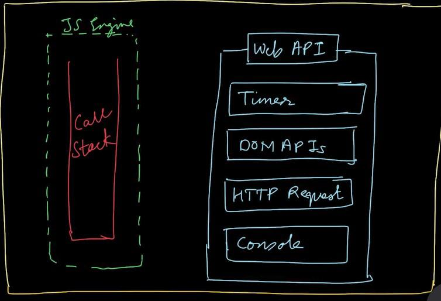
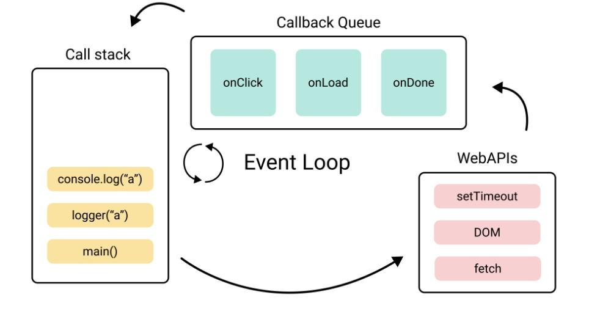

#### Use JS VISUALIZER 9000 FOR VISUALIZED AND EASY LEARNING

# How async Js Works ?
JavaScript is a Single-threaded Synchronous language by single Threaded means that the js engine has a single thread to execute instructions. By synchronous, it means that the js engine executes code line by line (one line at a time).

# What is Async Programming?
Async programming is a programming model that allows code to run asynchronously or non-blocking. This means that while a task is being executed, other code can continue to run concurrently without waiting for the task to complete.

### So how does async behavior is achieved by JavaScript?
It is important to understand that the js engine only has a single call stack to execute js code but it still manages to make async programming work like fetching data from a server, calling set timeout, providing timer, local Storage, etc. So How do JS engines execute all that?
The ability of js to execute async tasks like calling an API, doing console.log, and manipulating dom events is not part of the js engine but it is provided by the browser where the js engine executes javascript code. Let's look at the image below to understand what all functionalities the browser provides to the js Engine.

 

The timer is provided by the browser which allows the power to execute methods like setTimeout and setInterval that allow certain delays in the set timeout call.

All the dom-related methods to access and attach event listeners on certain nodes are also provided by Browser to the js engine.
Even the most famous console is not part of the js engine but is part of web-api provided by the browser.

Let us now try to understand how async code gets executed.

Example -1 
<pre>
console.log("Line1");
setTimeout(function callback1(){
  console.log("Line3");
  
},3000);
console.log("Line6");
</pre>

Output
Line1
Line2
Line3

To understand how this code works out we need to understand the event loop and callback queue 

# Event Loop  
In JavaScript, an event loop is a mechanism that enables asynchronous programming. The event loop works by continuously processing a queue of events and executing any associated callbacks or functions.

# Callback Queue
In JavaScript, the callback queue is a mechanism used by the event loop to manage asynchronous code execution. Whenever an asynchronous operation is performed, such as a timer set by setTimeout() or an HTTP request made by fetch(), the associated callback function is added to the callback queue.

The event loop constantly monitors the callback queue and executes the callbacks in the order in which they were added, one at a time. This ensures that the JavaScript runtime remains single-threaded and that no two callbacks are executed simultaneously.

#### Explanation For the code example above 

first, line1  is executed and it simply prints console.log("line1") then as soon as js engines encounter setTimeout it sets a timer in the web API and the call stack gets empty then line 6 gets executed due to javascript synchronous and non-blocking nature. Once the timer is expired in the web-API it registers and passes the callback function in the callback queue also at the same time event loop is continuously monitoring the call stack whether it is empty or not, once it sees the call stack as empty it pushes the callback method in the call stack and then callback function gets executed and it prints to console.log("line6");

 Example 2 :
<pre>
console.log("lets Start");   // line1
const btnAddtoCart = document.getElementById("btn");  //line2
btnAddtoCart.addEventListener("click",()=> {     //line3
  console.log("Button Clicked");
});
console.log("Bye Bye ......");
</pre>
Let us try to understand the execution of the code above line by line.

Initially, the line1 console.log("Let Start") is printed then js engine moves to the next line and extracts the node from the DOM and saves its reference in a variable called btnAddtoCart.
Then as soon it encounters line 3, event listener is registered in the web-API and the js engine moves forward and prints the last line console.log("Bye Bye ").
Once a user clicks on the button to which the event listener is attached, the callback is pushed into the callback queue, and once the event loop finds the call stack as empty callback queue pushes the callback function into the call stack, and the function gets executed.
So the output of the above will always be:
"lets Start"
"Bye Bye ....."
"Button Clicked"
 
Here is the image of the Event loop and callback queue
 

We have an important point to understand in case we have both the setTimeout and Promise callbacks in our code then whose Callback will be executed first?

The callback queue is the queue which is also known by the name task Queue but we also have a queue named microTask queue.
All the promised-based callbacks are registered inside the microtask queue and have the highest priority and all the other types of callback are pushed into the callback queue or the task queue as it have less priority then the microtask queue.