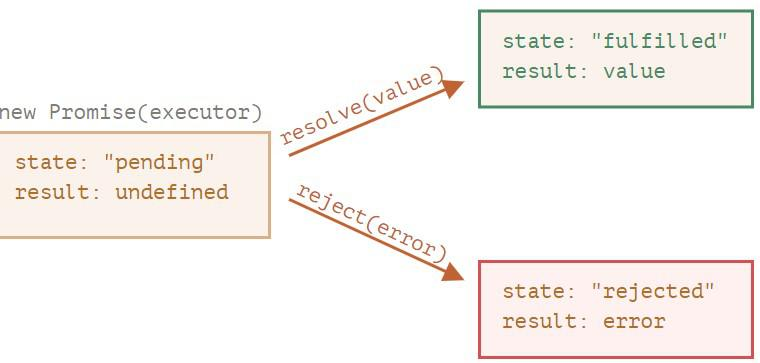

# Promises in Javascript
A promise in JavaScript represents the eventual outcome of an asynchronous operation and its value, whether successful or failed. Promises are commonly used to handle various asynchronous tasks such as fetching data from an API, reading files, or waiting for a timer to expire.

Consider Promise as a special Object in Javascript which has different states and corresponding different values of each state.
A promise is initially in a pending state and changes to either a "Fulfilled" or "rejected" state depending on whether the promise was resolved or rejected. Initially, the value of the promise is undefined and changes to the value of the resolve(value) method if the promise is successful or changes to an error in case the reject(error) method is called.
Look at this diagram to understand it in a better way.

 

 

Now let us Understand How can we consume promises?
In case we are fetching data from an API using the fetch method which returns a promise we need to consume it to read the actual response from the server. let us look at the example of a fetch call and how can we consume a promise returned by Fetch().
 

<pre>
let promise1 = fetch('https://randombig.cat/roar.json');
promise1.then(function(response){
  return response.json();
}).then(function(commits){
 alert(commits[0].author.login)
}).catch(function(error){
 alert("Some Error in fetching response")
});
</pre>

In the code above we have special methods then and catch which are used to consume promises. we attach then method to the promise and pass a callback function to then method which will be executed once the promise is successfully resolved in case the promise is rejected catch method callback function gets executed and displays the appropriate response.
It is important to remember that each call on then method also returns the promise whose fulfilled value is equal to the value returned by the callback function inside then method.