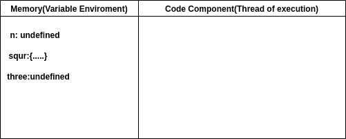
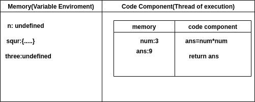

## How JS executes code
In the previous lesson, we discussed the concept of execution context in JavaScript. Now, let's dive deeper into how JavaScript code is executed concerning the execution context.

# JavaScript Execution Context: An Overview
Whenever JavaScript encounters a code snippet, it activates the JavaScript engine, which creates an environment called the execution context. This context is created in two phases:

# Creation Phase: Allocates memory to variables and functions.
Execution Phase: Executes the code line by line.
Execution Phases Explained
Creation Phase
In the creation phase, the JavaScript engine:

Scans through the code.
Allocates memory for variables declared with var and function declarations.
Assigns undefined to variables and stores the function definitions.
Execution Phase
In the execution phase, the JavaScript engine:

Executes the code line by line.
Updates the values of variables and executes functions.

- PICTORIAL REPRESENTATION OF EXECUTION CONTEXT:
https://media.geeksforgeeks.org/wp-content/uploads/20230324132106/Pic1.jpg

# Sample Code Execution
# Consider the following sample code:
- Now we write a demo code below and we will say line by line, how the code run.  

<!-- var n = 3;
function squr(num) {
    var ans = num * num;
    return ans;
}
var three = squr(n); -->

When you run this whole code a global EXECUTION CONTEXT is created and it contains two parts one is memory and the other is code execution.

When the first line is encountered it will reserve memory for all variables(n, three, five) and function(square). When reserving the memory for variables it reserves a special value undefined and for function, it stores whole code. the pictorial representation is shown below.

- PICTORIAL REPRESENTATION OF GLOBAL EXECUTION CONTEXT : 

 
After allocating memory for all variables and function, code execution phase starts(code runs line by line).
- Line 1: var n=3,  3 value placed into the n identifier.
- Line 2-5: nothing to execute.
- Line:6: we invoke a function, now function is the heart of JavaScript. The function is a mini-program and whenever a new function is invoked all together a new EXECUTION CONTEXT is created(inside the code execution phase). It also contains two-part memory and code execution phase. Memory is allocated for variable and function(it involves function parameters and other variables).

# PICTORIAL REPRESENTATION OF FUNCTION EXECUTION CONTEXT : 
 
 
After allocating memory, the code execution phase comes here the code inside the function executes, and undefined is replaced by the actual value.

PICTORIAL REPRESENTATION  OF EXECUTION CONTEXT WHILE FUNCTION EXECUTE

After that, when 'return' is encountered, the control of the program is returned to the place where the function is invoked. The control goes to line 6, finding the answer in the local memory. The control then returns to line 3, and the value of 'three' (undefined) is replaced by the value of 'ans'. After that, the entire execution context is deleted.

# PICTORIAL REPRESENTATION OF GLOBAL EXECUTION CONTEXT AFTER  CODE EXECUTED:
- https://media.geeksforgeeks.org/wp-content/uploads/20230324132706/gec1.jpg

After that Global Execution Context is Deleted and our program ends. And One more thing, JavaScript Handle everything deleted and created (to manage the execution context) it’s managing a stack. It's name CALL STACK. It’s a Stack that maintains the order of execution. 

# Conclusion
The execution context is crucial for understanding how JavaScript code is executed. It consists of the creation phase, where memory is allocated, and the execution phase, where the code is executed line by line. The call stack helps manage the execution order of multiple functions, ensuring that JavaScript remains a single-threaded synchronous language. Understanding these concepts is fundamental for writing efficient and bug-free JavaScript code.

