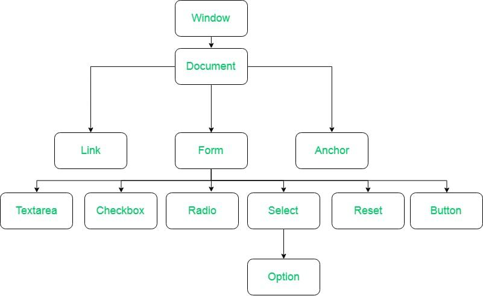
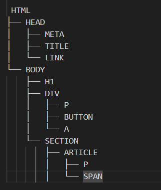

# What is DOM?
The Document Object Model, or DOM, is a critical concept in web development. It serves as the interface between HTML documents and JavaScript, enabling scripts to dynamically access and update the content, structure, and style of a document.

# What is the DOM?
The DOM stands for Document Object Model. It represents the HTML structure of a webpage in a tree-like format, where each node corresponds to an element in the document. This structure allows programming languages like JavaScript to interact with the document in a structured way, manipulating elements, attributes, and content.

# How and When is the DOM Created?
The creation of the DOM follows a specific process during the page load:

1. HTML Loading: The browser first loads the HTML document.
2. HTML Parsing: As the browser loads the HTML, it begins parsing it from top to bottom.
3. DOM Tree Creation: During parsing, the browser constructs the DOM tree. This tree represents the hierarchical structure of the HTML document.

# Structure of the DOM Tree
The DOM tree starts with the HTML element as the root, which branches out into child nodes such as HEAD and BODY. These child nodes further branch out into their own child nodes, forming a tree structure.

# Properties of DOM :

 <!-- HTML
├── HEAD
│   ├── META
│   ├── TITLE
│   └── LINK
└── BODY
    ├── H1
    ├── DIV
    │   ├── P
    │   ├── BUTTON
    │   └── A
    └── SECTION
        ├── ARTICLE
        │   ├── P
        │   └── SPAN -->

* Window Object: Window Object is object of the browser which is always at top of the hierarchy.  It is like an API that is used to set and access all the properties and methods of the browser. It is automatically created by the browser.
* Document object: When an HTML document is loaded into a window, it becomes a document object. The ‘document’ object has various properties that refer to other objects which allow access to and modification of the content of the web page. If there is a need to access any element in an HTML page, we always start with accessing the ‘document’ object. Document object is property of window object.
* Form Object: It is represented by form tags.
* Link Object: It is represented by link tags.
* Anchor Object: It is represented by a href tags.
* Form Control Elements: Form can have many control elements such as text fields, buttons, radio buttons, checkboxes, etc.

# Why is the DOM Tree Created?
The DOM tree is created to allow JavaScript to interact with the HTML document. Since JavaScript cannot directly understand HTML, the DOM provides a structured model that JavaScript can manipulate. This allows for tasks like searching for elements, adding event listeners, modifying content, and updating styles.

# Manipulating the DOM
JavaScript interacts with the DOM using various methods:

* Searching for Elements: 
Methods like document.getElementById(), document.getElementsByClassName(), and document.querySelector() allow you to select elements in the DOM.
* Modifying Elements: 
Once an element is selected, its content, attributes, and styles can be changed using properties and methods like innerHTML, setAttribute(), and style.
* Event Handling: 
Event listeners can be added to DOM elements to respond to user interactions, such as clicks or key presses.

# The Role of DOM in Webpage Rendering
The DOM is crucial in rendering a webpage. The process is as follows:

* HTML Loading and Parsing: 
The browser loads and parses the HTML to create the DOM.
* CSS Loading and Parsing: 
Concurrently, the browser loads and parses the CSS, creating the CSS Object Model (CSSOM).
Render Tree Creation: The DOM and CSSOM are combined to create the render tree, which represents the document's content and styles.
* Layout and Painting: 
The render tree is used to calculate the layout, determining the position and size of each element. Finally, the browser paints the elements onto the screen.

# Conclusion
Understanding the DOM is fundamental to web development. It is the foundation upon which JavaScript interacts with a webpage, allowing for dynamic content manipulation, user interaction, and responsive design. By understanding how the DOM works, you can harness the full power of JavaScript to create interactive and engaging web applications.